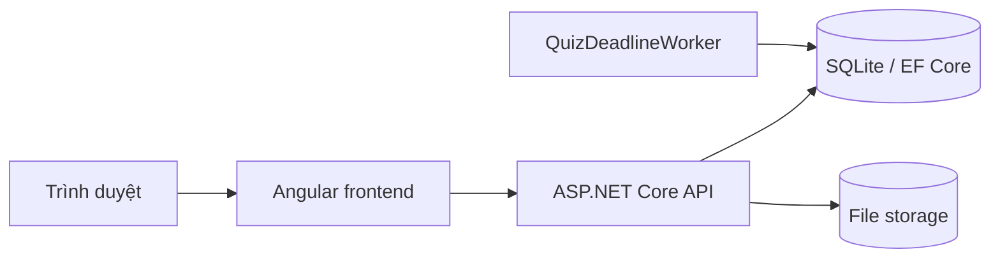

# Architecture

T-French là một ứng dụng triển khai chung: frontend Angular và backend ASP.NET Core. Dữ liệu nghiệp vụ dùng SQLite qua EF Core; file tải lên được lưu ngoài `wwwroot` và đi qua API có kiểm tra quyền. [README gốc](../README.md) ghi lệnh chạy; [STATUS.md](STATUS.md) ghi phiên bản và kết quả xác minh gần nhất.

## Sơ đồ thành phần

Trong development, `ng serve` chạy frontend riêng và gọi API tại `http://localhost:5083/api`. Ở bản Docker production, ASP.NET Core phục vụ các file Angular và API cùng domain; frontend gọi `/api`. `Dockerfile` dùng Node cho frontend và .NET SDK/runtime cho backend.

## Nơi tìm code

| Mục đích | Đường dẫn |
| --- | --- |
| Routing và màn hình | `frontend/src/app/app-routing.module.ts`, `frontend/src/app/view/` |
| Gọi API, xác thực phía client | `frontend/src/app/services/` |
| HTTP endpoints và kiểm tra quyền | `backend/TFrench.API/Controllers/` |
| Nghiệp vụ, file, audit, quiz deadline | `backend/TFrench.API/Services/` |
| Entity, DTO, quan hệ và migration | `backend/TFrench.API/Models/`, `DTOs/`, `Data/` |
| Khởi tạo middleware, database, health | `backend/TFrench.API/Program.cs` |

## Quan hệ nghiệp vụ chính

- `Course` là chương trình học; `CourseClass` là lớp/cohort của chương trình; `Enrollment` gắn học viên với lớp và có trạng thái.
- `Assignment` và `Submission` phục vụ giao/nộp/chấm bài; `Resource` và `StoredFile` phục vụ tài liệu và file.
- Bài tập có trạng thái `Draft`, `Published`, `Closed`: chỉ nháp được sửa; học viên thấy bài đã công bố/đóng theo quyền lớp, chỉ nộp khi Published. Các endpoint công bố/đóng ghi audit; bài tập đã có bài nộp không bị xóa qua API.
- `Submission.AttemptNumber` mặc định 1; lượt sau cần grant từ giáo viên/Admin; unique index theo bài tập/học viên/lượt ngăn tạo trùng. Thử lại POST với cùng nội dung trả cùng bài đã lưu, kể cả điểm đã chấm; nội dung khác trả 409. Grant có lý do và hạn riêng; các lượt cũ vẫn giữ file/điểm.
- `Resource`/`Assignment` có `ClassId` nullable: có lớp thì kiểm tra Enrollment Active đúng lớp; dữ liệu cũ không có lớp giữ phạm vi khóa. `LearningAccessService` dùng chung quy tắc cho danh sách, chi tiết, file và quyền nộp/chấm bài. Tài liệu `IsPublic` dành cho mọi tài khoản đăng nhập.
- `Quiz` gắn với lớp; `QuizAttempt` là lượt làm của học viên. `QuizDeadlineWorker` chốt các lượt hết giờ ở phía server.
- `ContactLead` lưu yêu cầu tư vấn và có thể liên kết tới học viên/ghi danh. `AuditLog` lưu các hành động nhạy cảm được instrument trong code.

Các quan hệ database nằm trong `backend/TFrench.API/Data/AppDbContext.cs`. Chi tiết vận hành nằm trong [RELIABILITY.md](RELIABILITY.md); không suy từ sơ đồ này rằng mọi luồng đã có kiểm thử đầu cuối.

## Hoàn thiện học tập ngày 07/10

- Assignment mới có OpenAt/DueDate/CutoffAt; server UTC quyết định giờ nhận bài và nhãn IsLate. Cutoff null giữ hành vi lịch sử. DTO thời gian luôn có UTC offset, kể cả giá trị đọc từ SQLite.
- Submission và QuizAttempt có ReleasedAt; DTO học viên ẩn điểm/feedback trước release trên mọi đường đọc/retry. Chấm lại thu hồi release; quiz release sau CloseAt, đáp án đúng theo cài đặt.
- AssignmentResubmissionGrant gắn bài/học viên/lượt, người cấp, lý do và cutoff; không dùng bài nộp rỗng làm lượt chờ. Các thao tác assignment đọc/kiểm tra/ghi dùng transaction SQLite để tránh đua đóng/nộp/cấp lượt.
- Quiz finalize dùng transaction và đọc lại snapshot đáp án mới nhất, tăng Version; autosave đồng thời kiểm tra deadline/status/version trước khi ghi.
- LearningController cung cấp lớp được truy cập, overview hoạt động theo lịch và gradebook read model. Teacher/Admin thấy điểm nháp; Student chỉ có dòng của mình và điểm đã release. Frontend `/dashboard/learning` đọc các nguồn Assignment/Quiz/Resource.
- Vận hành: `ops/data_backup.py`, `ops/staging_smoke.py`, `compose.staging.yaml`; kiểm thử/CI ở `frontend/e2e/` và `.github/workflows/validation.yml`.

File có thể được nhiều bản ghi tham chiếu: tải file dùng bất kỳ liên kết có quyền, không dừng ở bản ghi đầu tiên; thay/xóa tài liệu chỉ dọn file khi không còn Resource/Assignment/Submission nào tham chiếu.
