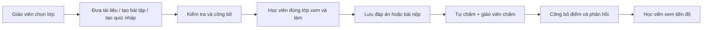

# Tài liệu, bài tập và bài kiểm tra: đánh giá và hướng thiết kế

**Ngày rà soát:** 01/10/2026
**Trạng thái:** Đề xuất để thảo luận và lập kế hoạch; chưa phải phạm vi đã duyệt.
**Phạm vi:** Kho tài liệu, giao/nộp/chấm bài tập, quiz online, quyền theo lớp và kết quả học tập.

**Cập nhật 07/10:** Deadline/nộp trễ, preview quiz, release kết quả, lượt nộp lại, gradebook/overview và E2E/CI đã có code và kiểm tra cục bộ. Phần đánh giá bên dưới vẫn là ảnh chụp 01/10; xem [STATUS.md](STATUS.md) và [đặc tả đợt hoàn thiện](LEARNING_COMPLETION_EXECUTION.md) cho tình trạng mới.

**Cập nhật 02/10/2026:** Các nhận định bên dưới là ảnh chụp 01/10. Code đã bổ sung quyền Resource/Assignment theo lớp, form chọn phạm vi và sửa autosave quiz; xem [STATUS.md](STATUS.md) cho bằng chứng kiểm tra và phần còn lại.

Sơ đồ luồng riêng cho học viên, giáo viên, Admin và kế hoạch triển khai theo gói nằm trong [LEARNING_WORKFLOWS_IMPLEMENTATION_PLAN.md](LEARNING_WORKFLOWS_IMPLEMENTATION_PLAN.md).

## Kết luận ngắn

Hệ thống **đã có phần lớn MVP cho một lớp học có kiểm soát**: giáo viên đưa bài tập; học viên nộp file/link/ghi chú; giáo viên chấm và phản hồi; quiz cho phép làm trắc nghiệm lẫn tự luận trên web, lưu đáp án, nộp bài, tự chấm câu khách quan và chấm tự luận. Kho tài liệu dùng được nhưng tài liệu riêng tạo từ giao diện hiện chưa gắn khóa/lớp để học viên thấy đúng phạm vi. Bốn integration tests backend đã pass trong container .NET 10 ngày 30/09/2026 theo [STATUS.md](STATUS.md).

Hệ thống **chưa đủ cho quy trình LMS nhiều lớp vận hành ổn định**. Tài liệu, bài tập và quiz dùng phạm vi truy cập khác nhau; giao diện tạo tài liệu chưa liên kết tài liệu riêng với khóa/lớp; bài tập chưa có chính sách nộp trễ/nộp lại; độ tin cậy của autosave và file upload cần được củng cố. Không có bằng chứng trong repository về triển khai Railway, backup/restore hoặc kiểm thử trình duyệt.

## Luồng nên hướng tới

Đề xuất giữ `Assignment` và `Quiz` là hai phân hệ riêng vì một bên nhận file/link, bên kia lưu đáp án theo câu hỏi. Dùng **CourseClass làm phạm vi giao bài chính**; `Course` giữ nội dung chung, còn `Lesson` là lớp tổ chức nội dung sẽ bổ sung sau. Tạo một trang lịch học tập và một bảng điểm đọc từ các phân hệ hiện có, thay vì gộp mọi dữ liệu vào một bảng lớn ngay từ đầu.

## Hệ thống hiện tại

| Khả năng | Đã có | Giới hạn quan sát từ code |
| --- | --- | --- |
| Tài liệu | `Resource` nhận file upload hoặc URL, có danh mục và `IsPublic`; file lưu ngoài web root và tải qua endpoint có kiểm tra quyền | Backend có `CourseId` tùy chọn, nhưng form tạo ở `resourceList.ts/html` không nhập `courseId`. Tài liệu riêng tạo từ giao diện vì vậy không gắn khóa; học viên không thấy nếu không bật `IsPublic`. Chưa có liên kết lớp/bài học. |
| Bài tập | Giáo viên/Admin tạo bài theo khóa, có hạn nộp và file đề; học viên Active trong khóa nộp file/link/ghi chú; giáo viên/Admin chấm 0–10 và phản hồi | Form tạo vẫn yêu cầu nhập Course ID bằng số. Bài tập gắn `CourseId`, nên các lớp của cùng khóa cùng thấy; chưa có nháp/công bố. API cho nộp sau hạn và từ chối mọi lần nộp tiếp theo. |
| Quiz online | Quiz gắn `ClassId`; có nháp/công bố, thời gian mở–đóng, một lượt, câu một/nhiều đáp án và tự luận; autosave có version; server chốt hết giờ; chấm trắc nghiệm và tự luận | Học viên chỉ thấy quiz khi đã mở hoặc đã có lượt làm; giao diện giáo viên tạo và công bố nhưng chưa có thao tác sửa bản nháp dù API hỗ trợ. Chưa có điều chỉnh thời gian theo học viên, thông báo hoặc bảng điểm tổng hợp. |
| Kết quả | Học viên xem điểm/nhận xét của bài tập và quiz; giáo viên xem danh sách bài nộp, kết quả quiz và chấm tự luận | Chưa có gradebook thống nhất; Assignment dùng thang 0–10, Quiz dùng tổng điểm câu hỏi tùy đề. Chưa có rubric chấm thực tế hoặc quy tắc công bố điểm chung. |
| Kiểm thử | 4 integration tests cho health, ghi danh/lead và quiz; 3 smoke suites Bash cho file/lead/blog; từ 02/10 có test frontend autosave quiz | Chưa có integration test chuyên biệt cho Assignment/Resource hoặc E2E trình duyệt/CI. |

Nguồn đối chiếu chính: [ResourcesController](../backend/TFrench.API/Controllers/ResourcesController.cs), [AssignmentsController](../backend/TFrench.API/Controllers/AssignmentsController.cs), [QuizzesController](../backend/TFrench.API/Controllers/QuizzesController.cs), [FilesController](../backend/TFrench.API/Controllers/FilesController.cs), [mô hình bài tập](../backend/TFrench.API/Models/Assignment.cs), [mô hình quiz](../backend/TFrench.API/Models/Quiz.cs), [giao diện tài liệu](../frontend/src/app/view/resource/resourceList/resourceList.ts), [giao diện bài tập](../frontend/src/app/view/assignment/assignmentList/assignmentList.ts), [giao diện quiz](../frontend/src/app/view/quiz/quiz.ts) và [integration tests](../backend/TFrench.API.Tests/LearningWorkflowTests.cs).

## Những điểm cần sửa trước khi mở rộng

1. **Phạm vi lớp và quyền xem.** Quiz đã kiểm tra Enrollment Active đúng lớp; bài tập và tài liệu hiện dựa chủ yếu vào khóa. Chọn phạm vi rõ ràng cho từng nội dung: chung toàn khóa, riêng lớp hoặc riêng bài học. Với bài tập, giao cho lớp cụ thể và kiểm tra lớp ở API tải đề, nộp bài, xem/chấm bài. Giao diện giáo viên phải chọn từ danh sách lớp/khóa mình quản lý; bỏ nhập ID số.
2. **Tài liệu riêng từ giao diện.** Thêm chọn khóa/lớp vào form tài liệu, chỉ hiển thị các lựa chọn giáo viên có quyền. Cho phép giáo viên xem trước tài liệu với đúng vai trò học viên; diễn đạt `IsPublic` là “mọi tài khoản đã đăng nhập” nếu giữ hành vi API hiện tại. Link ngoài vẫn chịu quyền chia sẻ của nhà cung cấp bên ngoài.
3. **Chính sách bài nộp.** Backend hiện chỉ kiểm tra đã nộp, không kiểm tra `DueDate` trong `Submit`; chưa có ràng buộc unique trong database cho `(AssignmentId, StudentId)`. Chốt nộp trễ, thời điểm khóa, số lần nộp, nộp lại sau khi chấm và dấu thời gian UTC. Sau đó thêm ràng buộc dữ liệu và xử lý request đồng thời; nếu cho nộp nhiều lần, lưu lịch sử từng lượt thay vì ghi đè.
4. **Tin cậy khi làm quiz.** `quiz.ts` đặt `dirty = false` khi request lưu trả về; nếu học viên sửa tiếp trong lúc request còn chạy, trạng thái mới có thể bị xóa khỏi hàng chờ lưu. Sửa bằng revision cục bộ hoặc hàng đợi autosave: chỉ đánh dấu đã lưu cho đúng snapshot gửi đi, tự gửi tiếp nếu có thay đổi mới. Thêm test cho mạng chậm, mất mạng, hai tab, refresh và nộp sát giờ.
5. **Thang điểm và công bố kết quả.** `Submission.Grade` có comment `0–100` nhưng API/UI chấm `0–10`; Quiz dùng tổng điểm câu hỏi. Chọn một quy ước hiển thị gồm `earnedPoints`, `maxPoints`, phần trăm quy đổi và trạng thái đã công bố. Giáo viên cần biết lúc nào học viên thấy điểm, nhận xét và đáp án đúng; không tự động coi “đã chấm” là “đã công bố”.
6. **An toàn file.** Hệ thống đã giới hạn đuôi, kích thước và lưu ngoài web root, nhưng `FileStorageService` chưa kiểm tra chữ ký/nội dung file, chưa quét file độc hại và chưa dọn file tải lên mà không được gắn vào bài/tài liệu. Bổ sung kiểm tra theo rủi ro thực tế, quy trình quarantine/dọn file và test quyền tải chéo. [OWASP File Upload Cheat Sheet](https://cheatsheetseries.owasp.org/cheatsheets/File_Upload_Cheat_Sheet.html) khuyến nghị nhiều lớp kiểm soát, gồm nhận diện loại file, giới hạn kích thước, quyền và nơi lưu.

## Mô hình dữ liệu đề xuất theo từng bước

| Bước | Thay đổi tối thiểu | Lý do |
| --- | --- | --- |
| 1 | Thêm phạm vi hiển thị rõ ràng cho `Resource`; thêm `ClassId` cho `Assignment` và migration chuyển dữ liệu cũ có kiểm tra | Ngăn học viên lớp khác thấy hoặc nộp bài không dành cho mình; giữ được tài liệu chung toàn khóa |
| 2 | Thêm trạng thái `Draft/Published/Closed` cho Assignment; chính sách `DueAt`, `LateUntil`, `MaxSubmissions`, `ResultReleaseAt` hoặc các tùy chọn tương đương | Giáo viên kiểm soát thời điểm mở, khóa và trả kết quả |
| 3 | Lưu `SubmissionAttempt`/lịch sử phiên bản nếu cho nộp lại; giữ bài đã chấm và phản hồi không bị mất | Theo dõi rõ mỗi lượt nộp và chấm |
| 4 | Thêm `Lesson`/Module khi cần tổ chức chương trình; tài liệu/bài tập/quiz có thể gắn Lesson | Tạo đường học rõ ràng mà không phải gộp ba loại nội dung |
| 5 | Tạo gradebook dạng truy vấn/read model từ Assignment và Quiz; chỉ thêm bảng điểm riêng khi có nhu cầu chỉnh điểm, miễn trừ hoặc chốt kỳ | Tránh nhân bản điểm quá sớm |

Giữ quiz một lượt trong MVP hiện tại. Nếu sau này cần ngân hàng câu hỏi hoặc nhập/xuất giữa LMS, cân nhắc [1EdTech QTI](https://www.1edtech.org/standards/qti/index); chưa cần triển khai chuẩn này chỉ để chạy quiz nội bộ.

**Lưu ý migration:** Assignment hiện gắn Course, có thể đã được nhiều lớp cùng sử dụng. Không tự gán mọi bài cũ vào một lớp bất kỳ; giữ phạm vi Course cho bài cũ hoặc yêu cầu Admin chọn lớp trước khi chuyển.

## Thứ tự triển khai đề xuất

| Ưu tiên | Gói công việc | Tiêu chí hoàn thành |
| --- | --- | --- |
| P0 — sửa luồng hiện có | Gắn tài liệu với khóa/lớp trong UI; chọn lớp thay nhập Course ID; chặn truy cập/nộp khác lớp; chốt deadline và uniqueness của bài nộp; sửa autosave quiz; thống nhất thang điểm | Giáo viên tạo được tài liệu, bài tập, quiz cho lớp A; học viên A dùng được; học viên cùng khóa nhưng ở lớp B không xem/nộp được nội dung riêng của A; reload/mạng chậm không mất đáp án |
| P1 — hoàn chỉnh vận hành học tập | Nháp/công bố bài tập, chính sách nộp lại và nộp trễ, rubric và công bố kết quả, gradebook cơ bản, kiểm thử Assignment/Resource/E2E | Giáo viên quản lý trọn vòng đời; học viên thấy trạng thái từng việc; Admin tra cứu được tiến độ và lỗi được phát hiện trong CI |
| P2 — mở rộng | Module/Lesson, thông báo, điều chỉnh thời gian quiz theo học viên, phân tích kết quả, ngân hàng câu hỏi hoặc QTI khi cần | Chỉ chọn sau khi đo nhu cầu thực tế và đã ổn định P0/P1 |

Với bài kiểm tra có giới hạn thời gian, cần thiết kế cách gia hạn/điều chỉnh cho học viên phù hợp và thông báo sắp hết giờ; [W3C WCAG 2.2 về thời gian](https://www.w3.org/WAI/WCAG22/Understanding/timing-adjustable.html) nêu các lựa chọn và ngoại lệ cho giới hạn thời gian. Đây là yêu cầu thiết kế cần xem xét, chưa phải kết luận sản phẩm hiện tại đạt hay không đạt WCAG.

## Các quyết định cần chốt trước khi viết kế hoạch thực thi

1. Tài liệu nào chung toàn khóa, tài liệu nào chỉ cho một lớp/bài học? Giáo viên của lớp khác trong cùng khóa có được xem không?
2. Sau hạn, học viên được nộp trễ bao lâu, có bị trừ điểm, được nộp lại mấy lần và ai mở lại bài?
3. Thang điểm mặc định là 10, 100 hay điểm gốc theo đề? Quiz nhiều đáp án chấm tất cả hoặc không, hay cho điểm từng phần?
4. Khi nào học viên thấy điểm, nhận xét, đáp án đúng? Có cần giáo viên duyệt trước khi công bố không?
5. Quiz có phải bài kiểm tra tính điểm cao hay chỉ luyện tập? Có cần điều chỉnh thời gian riêng cho học viên không?
6. Có yêu cầu quét file, thời hạn lưu bài nộp và quyền xuất/xóa dữ liệu không?

Kế hoạch chi tiết W0–W7 đã được soạn trong [LEARNING_WORKFLOWS_IMPLEMENTATION_PLAN.md](LEARNING_WORKFLOWS_IMPLEMENTATION_PLAN.md). Khi các quyết định trên được duyệt, cập nhật [DECISIONS.md](DECISIONS.md) và chuyển các gói ưu tiên thành task thực thi, theo dõi trong [STATUS.md](STATUS.md). Không đánh dấu một gói là đã hoàn thành chỉ vì thiết kế đã được ghi lại.
