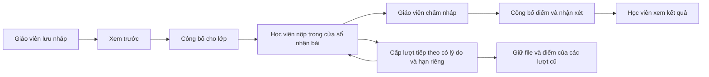

# Đợt hoàn thiện phân hệ học tập — 07/10/2026

Chủ dự án đã yêu cầu hoàn thành các bước tiếp theo ngày 07/10: thời gian nhận bài, xem trước quiz, E2E ba vai trò, CI, backup/restore và bản staging, công bố kết quả, bảng điểm/việc cần làm và lượt nộp lại. Đây là phạm vi thực thi của đợt này.

## Quy tắc đã áp dụng theo phương án được chấp thuận

- Bài tập mới mặc định khóa nhận bài khi hết hạn. Giáo viên có thể mở nhận bài trễ tới CutoffAt; bài trễ được gắn nhãn, không tự trừ điểm. Giờ mở phải trước hạn; thời điểm bằng cutoff đã bị khóa.
- Nội dung cũ giữ phạm vi khóa, không tự gán lớp. CutoffAt/OpenAt cũ để null giữ hành vi lịch sử; khi chuyển sang chính sách mới phải rà soát và đặt lịch rõ ràng.
- Điểm/nhận xét mới là nháp đến khi giáo viên công bố. Chấm lại thu hồi công bố để kiểm tra trước khi trả bản mới. Kết quả lịch sử đã chấm được backfill ReleasedAt để không mất quyền xem.
- Quiz chỉ công bố kết quả sau khi đóng đề; đáp án đúng/lời giải phụ thuộc cài đặt ShowAnswersAfterGrading. Giáo viên vẫn xem điểm nháp để chấm.
- Cấp lượt bài tập tiếp theo cho từng học viên cần lý do và cutoff riêng; không tạo thêm khi lượt đã cấp chưa được sử dụng. Lượt cũ, file cũ và điểm cũ giữ nguyên; POST ghi rõ AttemptNumber để retry lượt cũ không thành lượt mới.
- Bảng điểm hiển thị điểm gốc/thang/% của lượt mới nhất; học viên chỉ xem dòng của mình và điểm đã công bố. Lịch sử các lượt nằm ở bài tập.
- Backup phải chụp SQLite và upload cùng lúc khi ứng dụng dừng ghi. Restore tạo thư mục mới, kiểm tra inventory/hash/integrity/FK và file tham chiếu, không ghi đè thư mục đang chạy.

## Cổng nghiệm thu

| Phần | Bằng chứng cần có |
| --- | --- |
| API | Integration tests cho mốc giờ, đồng thời đóng/nộp, retry, release/redaction, grant và quyền bảng điểm |
| UI | Production build + unit tests + E2E Admin → giáo viên → học viên → chấm/công bố → xem kết quả/nộp lại |
| Quiz | Preview, reload, lỗi mạng và xung đột hai tab giữ đáp án; kết quả không lộ trước release |
| Migration | Thử trên bản sao snapshot lịch sử; giữ cột dữ liệu gốc và backfill điểm cũ đúng chính sách |
| Vận hành | Test backup/restore, production container smoke, tải file qua API sau restore; cấu hình staging tách dữ liệu |
| CI | Workflow chạy cùng các lệnh trên; chỉ xác nhận lần chạy GitHub sau khi có run thật |

Kết quả chạy và hạn chế môi trường được ghi tại [STATUS.md](STATUS.md). Railway, dữ liệu hiện hành và secret hosting bên ngoài cần quyền truy cập môi trường đích; chạy staging Docker cục bộ không xác nhận Railway đã triển khai.

## Tham khảo kỹ thuật

- [SQLite transactions trong Microsoft.Data.Sqlite](https://learn.microsoft.com/en-us/dotnet/standard/data/sqlite/transactions): transaction cho các thao tác đọc/kiểm tra/ghi nhận bài và đóng/cấp lượt.
- [Playwright web server](https://playwright.dev/docs/test-webserver), [browsers](https://playwright.dev/docs/browsers): kiểm thử trình duyệt với API thật trong container tách biệt.
- [SQLite Online Backup API](https://www.sqlite.org/c3ref/backup_finish.html): tạo bản sao database nhất quán, kết hợp dừng writer để chụp upload.
