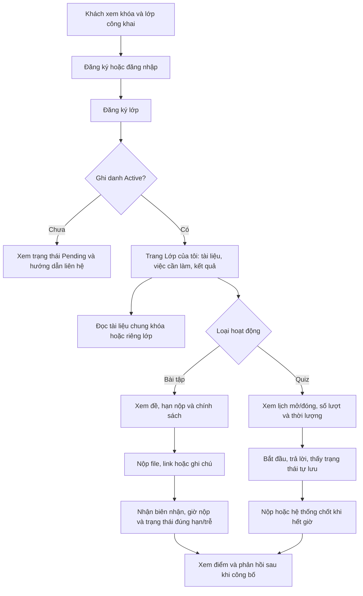
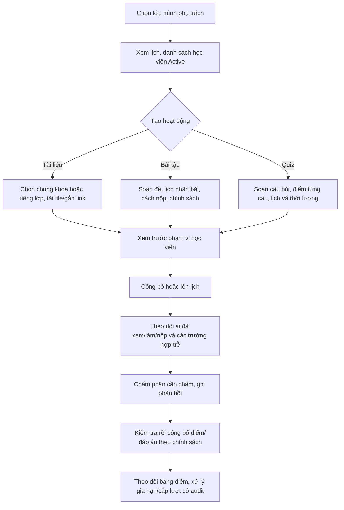
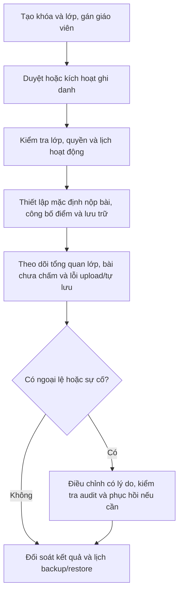
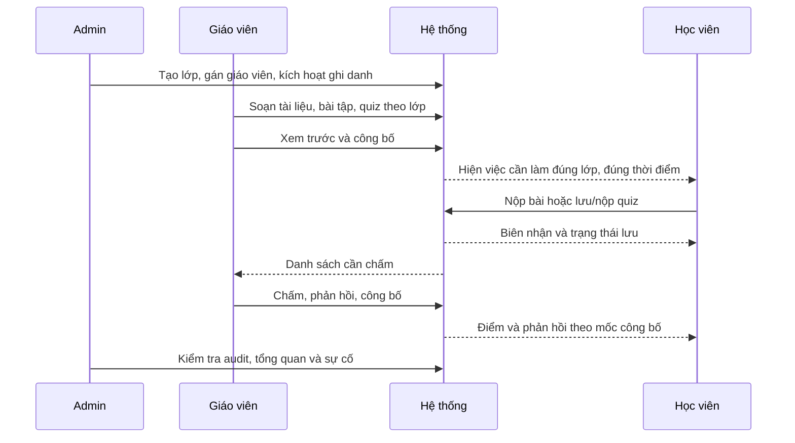

# Luồng theo vai trò và kế hoạch nâng cấp phân hệ học tập

**Rà soát:** 01/10/2026

**Trạng thái:** Kế hoạch đang triển khai từng phần theo yêu cầu tiếp tục của chủ dự án. Ngày 02/10: W1 đã có quyền theo lớp và migration giữ dữ liệu cũ; W2 đã có form chọn lớp/phạm vi; W4 đã sửa autosave và có unit tests. W0 mới kiểm kê và thử migration trên snapshot cũ. Các chính sách còn mở, nháp/công bố bài tập, deadline/nộp lại và W5–W7 chưa hoàn tất. Bằng chứng và bước tiếp theo ở [STATUS.md](STATUS.md).

**Phạm vi:** Tài liệu, bài tập có file/link/ghi chú, quiz online, chấm và trả kết quả cho học viên theo lớp.

**Cập nhật 03/10:** W2 đã nối sửa quiz nháp từ UI với kiểm tra đề đã công bố/có lượt làm và cảnh báo nội dung chưa lưu. Nháp/công bố bài tập và xem trước vẫn còn mở.

Đọc [đánh giá hiện trạng](LEARNING_ASSESSMENT_PLAN.md) trước khi thực hiện. Kế hoạch này chuyển các khoảng trống đã tìm thấy thành luồng người dùng, thay đổi cụ thể và tiêu chí nghiệm thu. `Course` là chương trình học; `CourseClass` là lớp cụ thể có giáo viên và học viên. Đề xuất mặc định: nội dung học tập riêng được giao theo lớp; tài liệu chung toàn khóa vẫn có chỗ đứng rõ ràng.

## 1. Tham khảo và lựa chọn thiết kế

| Mẫu đã đối chiếu | Áp dụng cho T-French | Mức ưu tiên |
| --- | --- | --- |
| Moodle phân biệt thời điểm bắt đầu nhận bài, hạn nộp để đánh dấu trễ và thời điểm khóa nộp. [Assignment settings](https://docs.moodle.org/502/en/mod/assignment/mod) | Dùng `OpenAt`, `DueAt`, `CutoffAt` thay vì một `DueDate` kiêm mọi ý nghĩa; server quyết định trạng thái nộp. | P0/P1 |
| Moodle giữ bản nháp, bài nộp cuối cùng và có thể cấp thêm lượt; điểm đã chấm có thể được giữ lại trước khi công bố. [Assignment settings](https://docs.moodle.org/502/en/mod/assignment/mod) | Bài tập có nháp/công bố, tối đa một lượt mặc định, cấp lượt bổ sung có lịch sử; tách `Graded` và `Released`. | P1 |
| Moodle quiz có lịch mở/đóng, giới hạn giờ làm và các mốc xem điểm/đáp án khác nhau. [Quiz settings](https://docs.moodle.org/502/en/Quiz_settings) | Giữ cơ chế thời gian phía server hiện có; bổ sung chính sách công bố điểm và đáp án độc lập. | P0/P1 |
| Moodle cho ngoại lệ thời gian/hạn theo học viên hoặc nhóm. [Quiz overrides](https://docs.moodle.org/502/en/Quiz_overrides), [Assignment overrides](https://docs.moodle.org/502/en/Assignment_overrides) | Bắt đầu từ ngoại lệ theo học viên có lý do và audit; nhóm là mở rộng sau. | P2 |
| OWASP khuyến nghị nhiều lớp kiểm tra file khi upload. [File Upload Cheat Sheet](https://cheatsheetseries.owasp.org/cheatsheets/File_Upload_Cheat_Sheet.html) | Kiểm tra chữ ký/nội dung phù hợp loại file, lưu cách ly khi cần, quét theo năng lực vận hành, dọn file mồ côi. | P1 trước vận hành thật |
| W3C nêu các lựa chọn để người dùng xử lý giới hạn thời gian. [WCAG 2.2 Timing Adjustable](https://www.w3.org/WAI/WCAG22/Understanding/timing-adjustable.html) | Hiển thị đồng hồ và cảnh báo rõ ràng; thiết kế ngoại lệ thời gian quiz trước khi dùng cho đánh giá quan trọng. | P1/P2 |

**Suy luận thiết kế:** Những nguồn trên mô tả khả năng của Moodle và hướng dẫn an toàn/truy cập; chúng không bắt buộc T-French sao chép toàn bộ LMS. Các lựa chọn phạm vi lớp, thứ tự ưu tiên và mô hình dữ liệu dưới đây là đề xuất cho quy mô trung tâm hiện tại.

## 2. Luồng người dùng đích

### 2.1 Khách và học viên

Khách chỉ xem khóa/lớp công khai. Hiện `ResourcesController` yêu cầu đăng nhập kể cả khi `IsPublic=true`; nếu vẫn giữ trường này, giao diện phải gọi đúng là **“mọi tài khoản đã đăng nhập”**. Học viên `Pending` không được xem nội dung riêng hoặc gửi bài. Học viên chỉ thấy bài nộp/lượt làm/điểm của chính mình.

### 2.2 Giáo viên

Giáo viên lớp chỉ thao tác dữ liệu lớp mình phụ trách. Nội dung chung toàn khóa cần quyền của giáo viên phụ trách khóa hoặc Admin; giáo viên lớp khác không mặc nhiên sửa nội dung chung. Sau khi có bài nộp/lượt làm, sửa đề hoặc chuyển lớp phải bị giới hạn để giữ ý nghĩa kết quả cũ.

### 2.3 Quản trị viên

Admin có thể quản lý mọi lớp nhưng các thay đổi nhạy cảm như chuyển học viên, đổi hạn, mở lại lượt làm hoặc sửa điểm cần ghi người thực hiện, lý do và thời điểm. Bảng tổng quan không thay thế quyền truy cập ở từng API.

### 2.4 Bàn giao giữa các vai trò

## 3. Hiện trạng so với luồng đích

| Bước | Đã có trong code | Việc cần sửa |
| --- | --- | --- |
| Chọn lớp và quyền | `ClassesController` có `GET /api/classes/my`; quiz kiểm tra lớp và ghi danh `Active`. | Bài tập/tài liệu đang lọc chủ yếu theo `CourseId`; thống nhất kiểm tra quyền ở danh sách, chi tiết, tải file, nộp/chấm. Quyền giáo viên lớp và giáo viên khóa phải rõ. |
| Tạo tài liệu | Backend nhận `CourseId`, file/link, `IsPublic`. | Form `resourceList.ts` chưa gửi `courseId`; thêm chọn phạm vi và lớp, nhãn quyền chính xác. |
| Tạo bài tập | Bài tập theo khóa, một `DueDate`, nhận file/link/ghi chú, chấm 0–10. | Form nhập `CourseId` bằng số; chưa nháp/công bố; API nhận bài sau hạn; không có unique index cho bài nộp. |
| Quiz | Theo lớp, nháp/công bố, một lượt, hạn và lưu đáp án có version. | UI giáo viên chưa sửa nháp dù API có; UI tự lưu có thể xóa cờ thay đổi mới khi request cũ trả về; quiz chưa mở không hiện như việc sắp tới. |
| Kết quả | Bài tập trả `Grade/Feedback` ngay khi chấm; quiz chấm trắc nghiệm/tự luận. | Chưa có trạng thái công bố chung, quy ước điểm thống nhất, trang việc cần làm và bảng điểm theo lớp. |

Nguồn code chính: [AssignmentsController](../backend/TFrench.API/Controllers/AssignmentsController.cs), [ResourcesController](../backend/TFrench.API/Controllers/ResourcesController.cs), [QuizzesController](../backend/TFrench.API/Controllers/QuizzesController.cs), [ClassesController](../backend/TFrench.API/Controllers/ClassesController.cs), [AppDbContext](../backend/TFrench.API/Data/AppDbContext.cs), [giao diện bài tập](../frontend/src/app/view/assignment/assignmentList/assignmentList.html), [giao diện tài liệu](../frontend/src/app/view/resource/resourceList/resourceList.ts) và [giao diện quiz](../frontend/src/app/view/quiz/quiz.ts).

## 4. Hợp đồng dữ liệu và quyền đề xuất

| Đối tượng | Phạm vi/trạng thái đích | Bất biến cần giữ |
| --- | --- | --- |
| `Resource` | `AudienceScope = Authenticated / Course / Class`, có `CourseId`, `ClassId` phù hợp. | `ClassId` phải thuộc `CourseId`; chỉ học viên `Active` của lớp hoặc khóa được xem/tải; bản ghi cũ `IsPublic=true` ánh xạ sang Authenticated, bản ghi có `CourseId` sang Course. Bản ghi riêng không `CourseId` phải được Admin phân loại, không tự công bố. |
| `Assignment` | `CourseId`, `ClassId?`, `Scope=CourseLegacy/Class`; `Draft/Published/Closed`, `OpenAt?`, `DueAt`, `CutoffAt?`, `MaxAttempts`. | Bài mới mặc định theo lớp; bài cũ giữ phạm vi khóa cho đến khi chuyển thủ công. `OpenAt <= DueAt <= CutoffAt` nếu có các mốc; mọi API dùng cùng chính sách quyền. |
| `Submission` | Giữ bản ghi nộp cũ; thêm `AttemptNumber` và khóa duy nhất `(AssignmentId, StudentId, AttemptNumber)`, `ClientRequestId`/cơ chế idempotency, trạng thái đúng hạn/trễ. | Dữ liệu cũ là lượt 1; một request lặp trả cùng kết quả; cấp lượt mới chỉ khi được phép, không ghi đè file/điểm lịch sử. |
| `Quiz`/`QuizAttempt` | Giữ một lượt trong MVP, thêm trạng thái công bố kết quả và ngoại lệ thời gian theo học viên về sau. | Mốc giờ dựa server; không tiết lộ đáp án đúng trước thời điểm công bố; không thay câu hỏi/điểm của đề đã có lượt làm nếu không có chính sách version. |
| Điểm | Bài tập lưu điểm gốc 0–10 ở giai đoạn chuyển tiếp; API hiển thị `earnedPoints`, `maxPoints`, `%`, `GradedAt`, `ReleasedAt`. | Giá trị chưa công bố không trả cho học viên qua bất cứ endpoint nào; giáo viên/Admin vẫn xem để chấm. Không đổi điểm cũ bằng migration âm thầm. |

Quy tắc truy cập áp dụng ở API, không chỉ ở Angular: Admin toàn quyền có audit; giáo viên quản lý lớp theo `CourseClass.TeacherId`; học viên phải có `Enrollment.Status=Active` đúng lớp cho nội dung Class, hoặc Active ở một lớp của khóa cho nội dung Course. File download phải theo đúng quyền của Resource/Assignment/Submission liên kết, kể cả khi biết `PublicId`. Link ngoài chịu quyền của nhà cung cấp link; UI cần báo điều này.

## 5. Kế hoạch thực thi theo gói phụ thuộc

Mỗi gói là một thay đổi có thể xem xét riêng. Dữ liệu và API được chuẩn bị trước khi bật UI; các API cũ được giữ tương thích trong thời gian chuyển đổi hoặc trả lỗi có thông điệp rõ ràng. `P0` đủ cho một đợt thí điểm nội bộ có kiểm thử; `P1` hoàn chỉnh vòng đời; `P2` chỉ làm theo nhu cầu thực tế.

| Gói / ưu tiên | Thay đổi cụ thể và vị trí dự kiến | Nghiệm thu tối thiểu |
| --- | --- | --- |
| W0 — chốt quy tắc và dữ liệu mẫu | Duyệt các mặc định ở mục 7. Kiểm kê số Resource không khóa, Assignment theo khóa, Submission/QuizAttempt và file đính kèm trên **bản sao** SQLite. Ghi quyết định vào `docs/DECISIONS.md`; tạo dữ liệu thử gồm hai lớp cùng khóa, giáo viên khác nhau, học viên Active/Pending. | Có bản sao DB/backup thử phục hồi, số lượng trước migration và ca kiểm thử quyền được ghi lại. |
| W1 — phạm vi và quyền, P0 | Migration cho `Resource`/`Assignment`; cập nhật models, `AppDbContext`, `ResourcesController`, `AssignmentsController`, `FilesController`; tạo một service/policy dùng chung cho danh sách, chi tiết, file, submit, grade. `ClassId` có FK; giáo viên chỉ chọn lớp từ `GET /api/classes/my`. Giữ record cũ ở Course scope; xử lý Resource riêng không khóa bằng trạng thái cần phân loại. | Học viên lớp A xem/nộp nội dung A; lớp B cùng khóa bị từ chối ở mọi endpoint; tài liệu chung khóa hiện cho A/B; Pending bị từ chối; giáo viên B không sửa nội dung A. |
| W2 — luồng tạo nội dung, P0 | `resourceList.ts/html`, `assignmentList.ts/html`, `quiz.ts/html`, interfaces và services: chọn lớp/khóa bằng tên, mô tả phạm vi, kiểm tra mốc giờ, trang xem trước; thêm sửa quiz nháp bằng API PUT sẵn có. Bài tập tạo mới là nháp, có nút công bố; có thể phải bổ sung API publish. | Giáo viên hoàn tất ba loại nội dung từ UI mà không gõ ID; học viên không thấy nháp; sau công bố học viên đúng lớp thấy lịch và đề. |
| W3 — hạn nộp và bài nộp, P0/P1 | `Assignment` có `OpenAt/DueAt/CutoffAt` và policy; `AssignmentsController.Submit` kiểm tra thời gian bằng UTC phía server. Thêm `AttemptNumber` + unique index và xử lý `DbUpdateException`; hỗ trợ request lặp an toàn. P1 bổ sung cấp lượt nộp lại và lịch sử lượt. | Đúng hạn/trễ/khóa có kết quả nhất quán; hai POST đồng thời không sinh hai lượt 1; file cũ và điểm cũ còn nguyên khi cấp lượt mới. |
| W4 — độ tin cậy quiz, P0 | `frontend/src/app/view/quiz/quiz.ts`: đánh số revision mỗi lần sửa; request lưu snapshot; chỉ xác nhận revision đã gửi; nếu phát sinh sửa mới thì lưu tiếp. Khóa nút nộp khi còn bản sửa chưa lưu, hiện `Đang lưu/Đã lưu/Lỗi lưu`; xử lý 409 bằng tải bản server và cảnh báo trước khi ghi đè. Kiểm tra backend submit/finalize idempotent. | Mạng chậm, sửa trong lúc đang lưu, refresh, hai tab và nộp sát hạn không âm thầm mất đáp án; học viên biết chính xác khi chưa lưu thành công. |
| W5 — chấm và trả kết quả, P1 | Bổ sung `ReleasedAt`/policy cho Assignment và Quiz, endpoint công bố, DTO học viên không lộ điểm/đáp án trước mốc; chuẩn hóa `earned/max/%`; cập nhật `assignmentDetail`, `quiz` và trang bảng điểm theo lớp dạng read model. Rubric bài tập ở mức tiêu chí đơn giản nếu giáo viên cần. | Giáo viên chấm nhưng chưa công bố thì học viên không thấy điểm/feedback; sau công bố chỉ thấy kết quả của mình; bảng điểm nhất quán khi điểm gốc khác thang. |
| W6 — trang việc cần làm và vận hành, P1 | Một endpoint/read model lớp học tổng hợp Resource, Assignment, Quiz đã công bố, thứ tự theo lịch; frontend hiển thị `Sắp mở/Đang làm/Đã nộp/Cần chấm/Đã trả`. Bổ sung log/audit cho công bố, sửa hạn, cấp lượt, sửa điểm; tăng kiểm tra nội dung file, dọn file mồ côi và quy trình backup/restore. | Học viên vào một lớp thấy đúng việc sắp tới; giáo viên/Admin thấy số bài cần chấm; sự cố file và thay đổi nhạy cảm có dấu vết. |
| W7 — ngoại lệ và mở rộng, P2 | Ngoại lệ `DueAt/CutoffAt/DurationMinutes` theo học viên có lý do, cảnh báo giờ quiz, thông báo, Module/Lesson, báo cáo sâu; ngân hàng câu hỏi/QTI chỉ khi có nhu cầu liên thông. | Ngoại lệ chỉ ảnh hưởng học viên được chọn, có audit; các chức năng P0/P1 vẫn qua regression. |

**Thứ tự đề xuất:** W0 → W1 → W2 + W3 + W4 (có thể làm trên các phần code riêng sau khi W1 ổn định) → W5 → W6 → W7. Trong thí điểm đầu, giữ một lượt bài tập/quiz và chỉ bật các màn hình đã qua ca quyền, deadline, lưu bài. Không gộp `Assignment`, `Quiz`, `Resource` vào cùng một bảng dữ liệu; trang tổng hợp chỉ đọc từ các phân hệ nguồn.

### Migration, triển khai và đường lui

1. Sao lưu SQLite **cùng file upload** và thử restore trên môi trường tách biệt. Kiểm kê bản ghi mồ côi/trùng trước khi tạo unique index; nếu có trùng, lập danh sách xử lý thủ công, không tự xóa.
2. Thêm cột nullable/trạng thái mặc định và migration có thể chạy trên bản sao DB; backfill `Submission.AttemptNumber=1`; giữ Assignment theo Course scope. Với Resource thiếu `CourseId` và không công khai, đánh dấu cần phân loại, không đoán lớp từ người upload.
3. Kiểm tra số lượng và liên kết file trước/sau migration. Test API cũ/new trên bản sao; chỉ sau đó mở form mới. Nếu phải lùi, khôi phục DB **và** upload cùng một snapshot, giữ bản ghi phát sinh sau thời điểm snapshot để đối soát trước khi quyết định.
4. Không sửa câu hỏi quiz đã có attempt trong migration; những thay đổi về công bố điểm cần có default giữ hành vi cũ hoặc được chuyển đổi có kiểm tra để không vô tình che/hiện điểm lịch sử.

## 6. Ma trận kiểm thử và cổng hoàn thành

| Ca kiểm thử bắt buộc | API | UI/E2E |
| --- | --- | --- |
| Lớp A và B cùng khóa; tài liệu/bài tập riêng A; tài liệu chung khóa | List, detail, download, submit, grade đều đúng quyền; thử URL trực tiếp | Học viên A/B và hai giáo viên nhìn thấy đúng mục |
| Active, Pending, không ghi danh, Admin | Trả đúng quyền, không lộ nội dung/điểm | Trạng thái chờ duyệt và thông điệp rõ |
| Mốc mở, đúng hạn, trễ, cutoff và hai request nộp đồng thời | Server giờ UTC; unique/idempotency; lịch sử lượt | Hiện múi giờ địa phương và biên nhận nộp |
| Quiz mạng chậm, mất mạng, hai tab, refresh, sát giờ | Version/conflict/finalize nhất quán | Chỉ hiện Đã lưu khi server xác nhận đúng revision; có cảnh báo lỗi |
| Chấm xong nhưng chưa công bố, công bố sau, sửa điểm | DTO học viên không lộ kết quả sớm; audit | Giáo viên và học viên nhìn thấy đúng trạng thái |
| Migration trên bản sao có dữ liệu cũ | Đếm bản ghi/quan hệ/file/điểm trước sau | Bài cũ vẫn mở được, không đổi phạm vi âm thầm |

Thêm integration tests vào `backend/TFrench.API.Tests/` cho Resource, Assignment, file và migration; thêm test frontend cho autosave state machine; một E2E trình duyệt đi qua Admin → Giáo viên → Học viên → Giáo viên → Học viên. Chạy build frontend, backend tests và migration rehearsal trong CI. Chỉ ghi “hoàn thành” khi có kết quả test với ngày, lệnh và môi trường trong [STATUS.md](STATUS.md). Các 4 backend tests hiện có và build ngày 30/09/2026 chỉ xác nhận baseline cũ.

## 7. Những quyết định cần chủ dự án chốt

Các giá trị dưới đây là **mặc định đề xuất để lập kế hoạch**, chưa phải chính sách đã duyệt:

| Chủ đề | Mặc định đề xuất | Nếu chọn khác, phần bị ảnh hưởng |
| --- | --- | --- |
| Phạm vi | Bài mới giao theo lớp; tài liệu có thể theo lớp hoặc chung khóa. | W1, W2, trang tổng hợp. |
| Nộp trễ | Cho nộp đến `CutoffAt` nếu giáo viên bật; gắn nhãn trễ, chưa tự trừ điểm. | W3, UI trạng thái, rubric. |
| Nộp lại | Một lượt mặc định; giáo viên/Admin cấp thêm lượt có lý do. | W3 và bảng điểm W5. |
| Điểm | Bài tập 0–10 hiện hành; quiz giữ tổng điểm câu hỏi; UI luôn hiển thị điểm gốc/max và %. | W5, dữ liệu cũ. |
| Công bố | Giáo viên chủ động công bố điểm/feedback; quiz chỉ hiện đáp án đúng sau khi đóng và công bố điểm. | W5, DTO và UI. |
| Ngoại lệ thời gian | Chưa bật trong thí điểm; phải có trước khi quiz dùng cho đánh giá quan trọng hoặc trường hợp cần hỗ trợ riêng. | W7. |
| Lưu file | Chốt thời hạn giữ bài nộp, quyền xóa/xuất và năng lực quét file trước production. | W6, backup, vận hành. |

Sau khi chủ dự án chốt, cập nhật [DECISIONS.md](DECISIONS.md), chia W1–W4 thành các task thực thi với migration/API/UI/test cụ thể, rồi cập nhật [STATUS.md](STATUS.md). Nếu cần làm sớm mà chưa chốt mọi lựa chọn, có thể làm các sửa lỗi độc lập chính sách như autosave quiz và form chọn lớp, nhưng chưa nên bật thay đổi phạm vi dữ liệu trên production.
